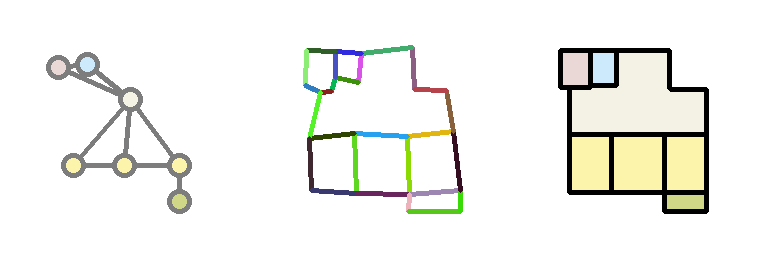

# Neural-Guided Room Layout Generation with Bubble Diagram Constraints



---
## Installation
- pytorch
- numpy
- tqdm
- shutil
- json
- opencv-python
- networkx
- ortools
- cvxopt
 
---
## Data

- download the RPLAN dataset from http://staff.ustc.edu.cn/~fuxm/projects/DeepLayout/index.html
- extract png data into './data/rplan/'
- run 
```
python3 ./data_utils/prepropcessing.py [path to png] [path to json]
```
- run 
```
python3 ./data_utils/data_split.py [path to split.txt]
```
---

## Training

- run 
```
python3 train.py [path to json] [path to split.txt] [path for saving model]
```
- run 
```
python3 train_geo.py [path to json] [path to split.txt] [path for saving model]
```

---

## Reasoning

- run 
```
python3 test.py [path to json] [path to split.txt] [path for result_1]
```
- run 
```
python3 test_geo.py [path to result_1] [path to split.txt] [path for result_2]
```

- run 
```
python3 ./post/orthogonal_drawing.py [path for result_2] [path for images]
```